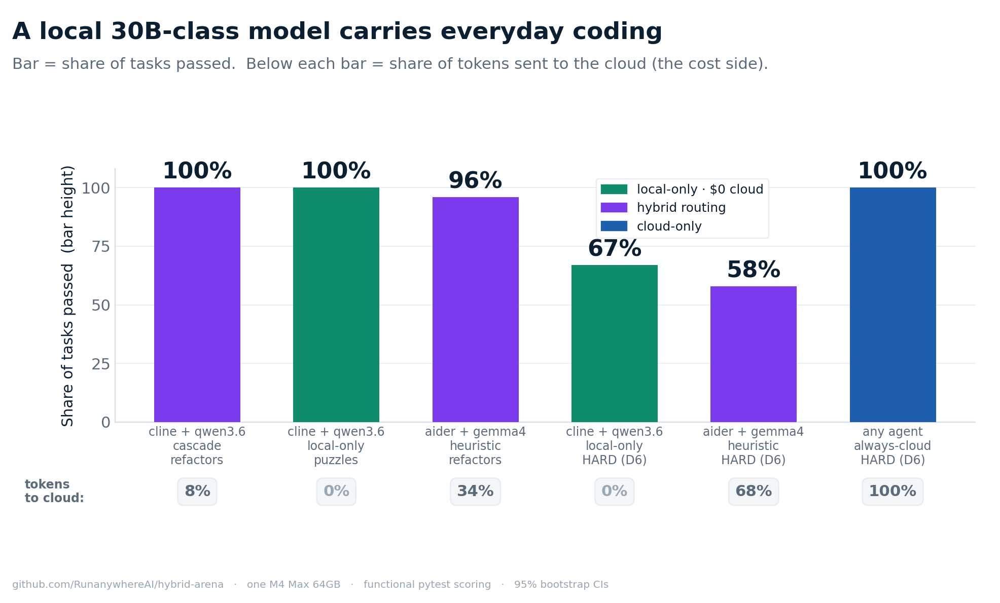
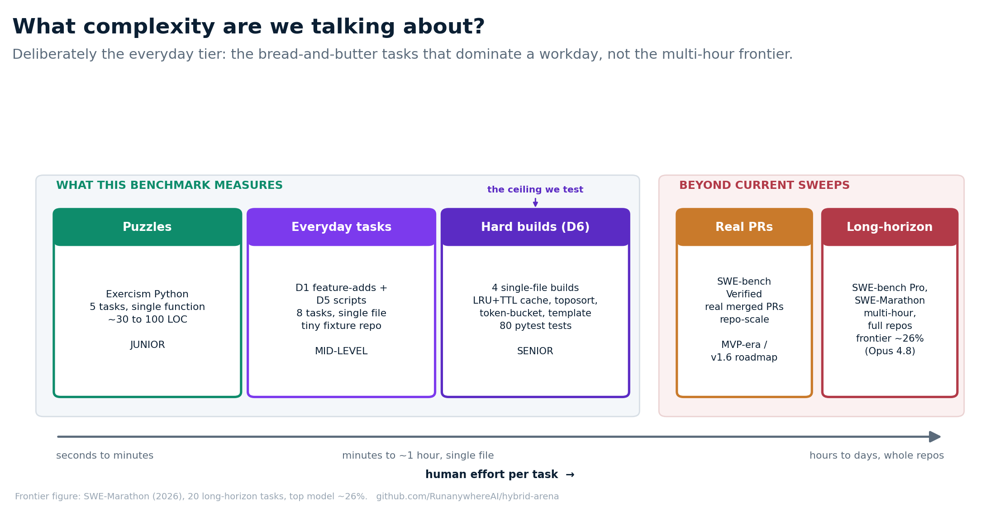
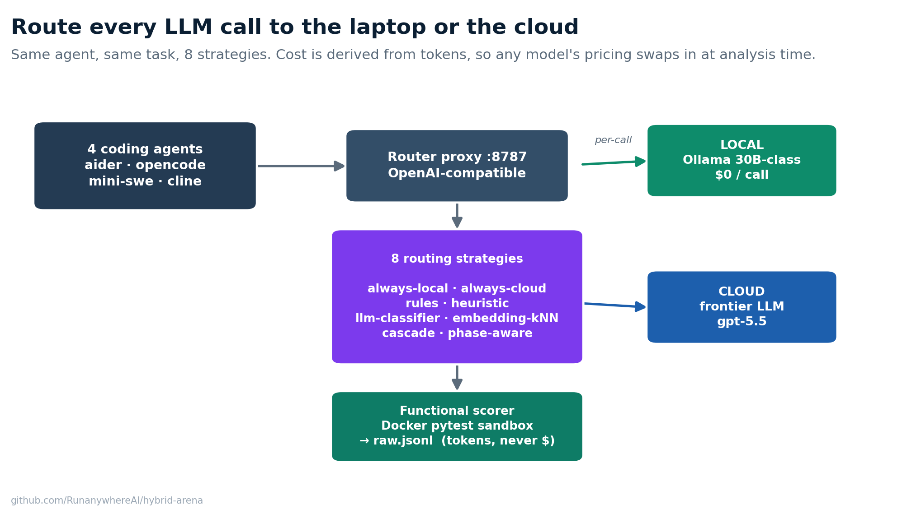
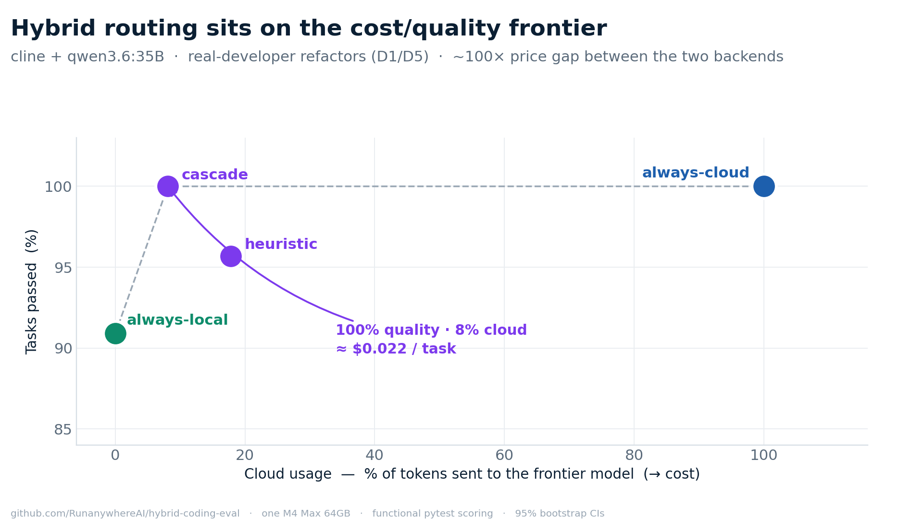

# Hybrid Coding Arena

> **Should this coding task run on my laptop, the cloud, or split between them?**
> Local vs cloud vs hybrid LLM routing for coding agents. Answer it empirically,
> on your hardware, with reproducible numbers. From RunAnywhere.

[](./LICENSE)
[](./CHANGELOG.md)
[](https://www.python.org/)
[](https://github.com/RunanywhereAI/hybrid-arena/actions/workflows/ci.yml)

A reproducible benchmark harness that measures four coding agents
(`aider`, `opencode`, `mini-swe-agent`, `cline`) across eight routing
strategies and three local models, against frontier cloud LLMs, on one
M4 Max 64 GB laptop. Every published number traces back to a single row
in `results/runs/<sweep>/raw.jsonl`, priced by a versioned pricing table.

**1,704 rows · 3 local models · 3 coding agents · 8 routing strategies · 17 tasks · 7 releases in 8 days.**



## Headline findings

| Cell | Pass-rate | Cloud-fraction | Notes |
| --- | --- | --- | --- |
| `cline + qwen3.6 + cascade + refactors` (D1/D5) | **24/24 = 100%** | **8%** | The cleanest hybrid cell in the benchmark, $0.022/task |
| `cline + qwen3.6 + always-local + refactors` (D6 hard tasks) | **8/12 = 67%**¹ | **0%** | 30B local-only ceiling, **zero cloud spend** |
| `cline + qwen3.6 + always-local + puzzles` | 15/15 = 100% | 0% | Local-only nails Exercism Python |
| `aider + gemma4 + heuristic + refactors` (D1/D5) | 23/24 = 96% [88, 100] | 34% | v1.3 marquee, replicates |
| `aider + gemma4 + heuristic + refactors` (D6 hard tasks) | 7/12 = 58% | 68% | Where heuristic routing breaks on harder tasks |
| `aider + gemma4 / cline + qwen3.6 + always-cloud` (D6 hard tasks) | 12/12 = 100% | 100% | gpt-5.5 ceiling on D6 |

¹ Conservative reading: 3 of the 4 misses are `cline` session-management bugs (the model never wrote code), not quality failures. The analyzer, which excludes error rows, scores this cell **8/9 = 89%**. We quote the stricter 67% in the headline.

Full numbers, confidence intervals, per-task breakdowns, and the
real-world walkthrough of every task we measured live in
[`docs/release-notes/v1.5.0.md`](./docs/release-notes/v1.5.0.md) and
[`docs/release-notes/v1.4.1.md`](./docs/release-notes/v1.4.1.md).

## Why this exists

LLM coding agents got good, fast. The cost gap between a frontier cloud model
and a 30B local model is now ~100×. The useful question is which tasks can stay
on your laptop. This repo measures the answer end to end:

- **Same agent, same task, different routes** → quality and cost are comparable.
- **Per-row tokens, not per-row cost** → pricing scenarios swap in at analysis time.
- **Bootstrap 95% CIs per cell** → "X beats Y" claims rest on the intervals.
- **One laptop, no cluster** → results are reproducible from a clean clone.

## Quickstart

Five minutes to a green smoke run. About an hour to a full canonical sweep.

### 1. Prerequisites

| Tool | Why | Install (macOS) | Install (Linux) |
| --- | --- | --- | --- |
| **Python 3.11 or 3.12** | Harness + agent runners | `brew install python@3.12` | `sudo apt install python3.12 python3.12-venv` |
| **git** | Clone the repo | (built-in) | `sudo apt install git` |
| **Docker** | Sandbox for the functional Python scorer | [Docker Desktop](https://www.docker.com/products/docker-desktop) | `sudo apt install docker.io` (+ add user to `docker` group) |
| **Node ≥ 18** | Router proxy (`router/server.mjs`) | `brew install node` | `sudo apt install nodejs npm` |
| **Ollama** | Serves the local model on `:11434` | [`ollama.com/download`](https://ollama.com/download) | `curl -fsSL https://ollama.com/install.sh \| sh` |
| **An `OPEN_AI_API_KEY`** | The cloud half of every hybrid call | <https://platform.openai.com/api-keys> | same |

### 2. Clone, install, and configure

```bash
git clone https://github.com/RunanywhereAI/hybrid-arena
cd hybrid-arena

python3.12 -m venv .venv
.venv/bin/pip install -e ".[dev,agents]"

cp .env.example .env
# edit .env and paste your OPEN_AI_API_KEY
```

### 3. One-time setup (Docker image + agents)

```bash
./arena setup
```

This builds the Python sandbox Docker image, installs the `cline` and
`opencode` CLIs via npm if missing, and runs a quick health check. It
is idempotent, so you can re-run it any time.

### 4. Smoke test (cloud only, ~30 seconds)

The smoke config runs **one task, cloud-only**, so you don't need a
local model pulled yet:

```bash
./arena sweep --config configs/v1.4-smoke.yaml --strategies always-cloud --seeds 42
./arena analyze results/runs/v1.4-smoke
```

If `arena analyze` produces a `bootstrap_cis.json` and a chart, the
harness is wired up correctly.

### 5. Run a real sweep (local model + hybrid strategies)

Pull a local model and run the canonical 4-strategy sweep:

```bash
ollama pull gemma4:31b                                # ~18 GB
./arena sweep \
    --config configs/v1.4-canonical-gemma4.yaml \
    --strategies always-cloud,always-local,heuristic,cascade \
    --seeds 42,7,13
./arena analyze results/runs/v1.4-canonical-gemma4
```

Expected wall-time on M4 Max 64 GB: 10 to 15 hours. Expected cloud spend
at gpt-5.5 list pricing: $30 to $50. Pause and resume any time:

```bash
./arena pause      # frees the laptop, keeps Ollama warm
./arena resume     # picks up at the next un-written row
./arena status     # PID + row count + RUNNING/PAUSED
```

When it finishes, compare your numbers against the canonical dataset
(`gh release download v1.6.0 -p results-v1.6.0.tar.gz`).

### Benchmark a new model

Three commands:

```bash
ollama pull <new-model>
./arena sweep --config configs/v1.4-canonical-gemma4.yaml \
    --set models.local=<new-model> \
    --set out_dir=results/runs/v1.4-<new-model> \
    --strategies always-cloud,always-local,heuristic,cascade --seeds 42,7,13
./arena analyze results/runs/v1.4-<new-model>
```

Headline cell to compare:

```bash
jq '.cells["refactors::cline::heuristic"].pass_rate' \
   results/runs/v1.4-<new-model>/bootstrap_cis.json
```

Reference points on the same cell from the canonical sweeps: 96% (qwen3.6),
92% (qwen3-coder), 96% (gemma4, error-adjusted; 71% on the conservative
n=24 reading that counts cline-session errors as failures).

## What's in the box

| Component | What |
| --- | --- |
| **4 coding agents** | `aider` · `opencode` · `mini-swe-agent` · `cline` |
| **8 routing strategies** | `always-cloud` · `always-local` · `rules` · `heuristic` · `llm-classifier` · `embedding-knn` · `cascade` · `phase-aware` |
| **3 task classes** | `puzzles` (Exercism Python, 5 tasks) · `refactors` (historical class name; the canonical cell is feature-adds (D1) + one-shot scripts (D5), 8 tasks, plus 4 D6 hard single-file builds. True refactor/review shapes (D3/D4) exist but were LLM-judged and sit outside the functional cell) · `real-prs` (SWE-bench Verified, adapter shipped, sweep is v1.6+ work) |
| **6 pricing scenarios** | `gpt-5.5` · `gpt-5` · `gpt-5-mini` · `claude-opus-4-7` · `claude-sonnet-4-6` · `claude-haiku-4-5` |
| **Functional scoring** | Sandboxed Python via Docker (`--network none`, memory caps, 60s timeout) |
| **Statistics** | Per-cell bootstrap 95% CIs on pass-rate, cost, cloud-fraction, wall-ms |

See [`docs/HYBRID_ROUTING_DESIGN.md`](./docs/HYBRID_ROUTING_DESIGN.md) for
the canonical design doc: what each agent does, how each routing strategy
decides, what each task class measures, and the result schema.

### What complexity are we measuring?

Deliberately the **everyday tier**: single-function puzzles up to senior
single-file builds (an LRU+TTL cache, a recursive-descent template engine). The
long-horizon frontier sits beyond it.
[SWE-Marathon](https://www.swemarathon.org/) runs multi-hour, whole-repo tasks
where Opus 4.8 tops out near 26%. We measured real merged PRs (SWE-bench
Verified) in the MVP era; the v1.x adapter ships and the agentic sweep is v1.6
work. We scope to where local-vs-cloud cost matters most.



## How it works (60-second tour)



```text
./arena sweep --config configs/v1.4-canonical-gemma4.yaml
    │
    ├── spawns ONE Node router proxy on :8787
    │   (LOCAL_MODEL + CLOUD_MODEL injected from config)
    │
    └── for each (strategy, seed):
        for each (task, agent):
            agent.run(task, proxy_url=":8787")
                │
                ├── agent makes N LLM calls through the router
                ├── router picks local-vs-cloud per call (current strategy)
                ├── router logs the decision to logs/decisions.jsonl
                ├── tokens come back via OpenAI-shape `usage` object
                │
            scorer runs the diff in a Docker sandbox
            row written to results/runs/<sweep>/<strategy>/seed-<seed>/raw.jsonl

./arena analyze results/runs/<sweep>/
    │
    ├── aggregate.json     # per-cell medians + totals
    ├── bootstrap_cis.json # 95% CIs on pass_rate / cost / cloud_fraction
    ├── decision_matrix.md # Markdown table with "Recommended" column
    └── charts/            # Pareto scatter + quality/cost heatmaps
```

Each agent is a thin wrapper around an externally-maintained tool. This
repo owns the **routing, the scoring, the analysis, and the result schema**.
It does not try to be a coding agent.

## Picking a config for real work



Distilled from the v1.5 leaderboard:

| You want… | Use this config | Why |
| --- | --- | --- |
| **Best everyday-task quality + lowest cost** | `cline + qwen3.6 + cascade` | 100% on the D1/D5 tasks at 8% cloud, $0.022/task |
| **Zero cloud spend, still serious quality** | `cline + qwen3.6 + always-local` | 100% on puzzles, 67% on D6 hard tasks, $0 cloud |
| **Maximum quality, cost is no object** | Any agent + `always-cloud` (gpt-5.5) | 100% across every cell we measured |
| **You know the task is hard** | Force `!cloud` on the model field | Cascade's router cannot always tell hard from easy |

What to **avoid**:

- `opencode + qwen models`: opencode's prompting fits gemma4, not the qwen variants.
- `aider + heuristic` on D6-class tasks: 58% pass while the router still sends 68% of tokens to the cloud (scores less, spends more).
- `mini-swe-agent + any local model`: it trails `aider` and `cline` on this benchmark.

## Sweep lifecycle (long sweeps)

For an overnight sweep you can detach + pause + resume:

```bash
./arena start  --config configs/v1.4-canonical-qwen3.6.yaml \
               --strategies always-cloud,always-local,heuristic,cascade \
               --seeds 42,7,13         # detaches, returns immediately
./arena status                          # PID + row count + RUNNING/PAUSED
./arena pause                           # frees the laptop, keeps Ollama warm
./arena resume                          # picks up at the next un-written row
./arena stop                            # also kills Ollama (~19 GB freed)
```

State lives in `/tmp/hcev-sweep.json`. Resume is row-level (`raw.jsonl` is
appended to as rows complete) so a crash mid-sweep loses at most one row.

## Bench CLI

All `arena` subcommands are documented in `arena <cmd> --help`.

| Command | Use |
| --- | --- |
| `./arena setup` | One-time Docker + npm + venv setup |
| `./arena sweep` | Run a sweep (auto-spawns the router) |
| `./arena start` / `pause` / `resume` / `stop` / `status` | Long-sweep lifecycle |
| `./arena run` | Single-pass run (no router auto-spawn; advanced) |
| `./arena analyze` | Per-cell medians + bootstrap CIs + charts |
| `./arena token-budget` | Token-first matrix re-priced under all scenarios |
| `./arena rejudge` | Re-run the LLM-judge on completed prose rows |
| `./arena rescore` | Re-run the functional scorer with a fresh sandbox image |
| `./arena env-detect` | Capture hardware + software snapshot |
| `./arena show-config` | Print the merged config + its SHA256 |
| `./arena schema` | Regenerate `configs/schema.json` from the Pydantic model |

## Repo layout

```text
hybrid-arena/
├── README.md                     ← you are here
├── AGENTS.md                     ← canonical guide for AI coding agents reading the codebase
├── CHANGELOG.md                  ← release history
├── CONTRIBUTING.md               ← how to add a model / agent / strategy
├── CODE_OF_CONDUCT.md            ← short and direct
├── SECURITY.md                   ← vuln-report channel
├── LICENSE                       ← MIT
├── bench                         ← top-level CLI dispatcher
├── .github/workflows/ci.yml      ← pytest + ruff on 3.11 / 3.12
│
├── src/hybrid_arena/
│   ├── core/                     ← config, experiment, metrics, pricing, paths, sandbox
│   ├── agents/                   ← aider, opencode, mini_swe, cline
│   ├── scorers/                  ← functional (Docker), swebench
│   ├── tasks/                    ← puzzles, refactors, real_prs
│   ├── analysis/                 ← aggregate, bootstrap, decision_matrix, cost_scenarios
│   ├── viz/                      ← Pareto + heatmap charts
│   └── cli/                      ← bench dispatcher + subcommands
│
├── router/                       ← zero-deps Node hybrid proxy on :8787
├── configs/
│   ├── v1.4-canonical-{gemma4,qwen3-coder,qwen3.6}.yaml
│   ├── v1.4-{smoke,strategy-sweep,opencode-fairness,real-prs}.yaml
│   ├── v1.5-hard-{gemma4,qwen3.6,smoke}.yaml
│   ├── pricing/pricing_tables.json   ← shared by Python and Node, SHA256-pinned
│   └── router/corpus.json            ← embedding-kNN labelled training data
│
├── tests/                        ← pytest (CI runs all, 120 fast tests)
├── results/                      ← v1.0 to v1.3 datasets tracked; v1.4+ as release tarballs
└── docs/
    ├── HYBRID_ROUTING_DESIGN.md  ← THE design doc (strategies + agents + methodology)
    └── release-notes/v1.*.md     ← per-release findings
```

## Reproducibility

Every row carries `task_id`, `route`, `router_strategy`, `seed`,
`cloud_model_id`, `local_model_id`, `config_sha`, `hardware_profile_ref`.
Costs are derived from `tokens × pinned pricing` at analyze-time, so a pricing
edit flows through `./arena analyze` without re-running inference. The harness
logs the pricing table SHA256 with each import.

The Node router and the Python harness both read the same
`configs/pricing/pricing_tables.json` and compute identical costs
(verified by `tests/test_pricing_parity.py`).

## License + citation

**Code, datasets, charts, and docs prose are all MIT-licensed.** See
[`LICENSE`](./LICENSE).

If you use this benchmark or its data in your own work, please cite it. A
citation is how a small research project gets seen:

```bibtex
@misc{monga2026hybridarena,
  author       = {Monga, Sanchit and contributors},
  title        = {Hybrid Coding Arena: reproducible cost/latency/quality
                  benchmark for local vs cloud vs hybrid LLM routing on
                  coding tasks},
  year         = {2026},
  howpublished = {\url{https://github.com/RunanywhereAI/hybrid-arena}},
  note         = {Version 1.6.0}
}
```

Third-party tools driven by this harness:

- [aider](https://github.com/Aider-AI/aider) (Apache 2.0)
- [opencode](https://github.com/RunanywhereAI/opencode-1) (MIT)
- [cline](https://github.com/cline/cline) (Apache 2.0)
- [mini-swe-agent](https://github.com/princeton-nlp/mini-swe-agent) (MIT)
- [Aider polyglot benchmark](https://github.com/Aider-AI/polyglot-benchmark): source of the 5 puzzle tasks (MIT, derived from [Exercism](https://exercism.org/))

## Read next

1. [`docs/REPRODUCING.md`](./docs/REPRODUCING.md): clean-clone to green-charts to compare-against-canonical, step by step.
2. [`docs/HYBRID_ROUTING_DESIGN.md`](./docs/HYBRID_ROUTING_DESIGN.md): the single canonical design doc (strategies, agents, schema, methodology).
3. [`docs/release-notes/v1.5.0.md`](./docs/release-notes/v1.5.0.md): the most recent findings (D6 hard-task stress test).
4. [`docs/release-notes/v1.4.1.md`](./docs/release-notes/v1.4.1.md): the canonical 3-model leaderboard.
5. [`AGENTS.md`](./AGENTS.md): folder-by-folder map for AI coding agents reading the codebase.
6. [`CONTRIBUTING.md`](./CONTRIBUTING.md): how to add a model, agent, strategy, or task class.
7. [`SECURITY.md`](./SECURITY.md): the vulnerability-disclosure channel.

Questions, reproduction issues, or new-model requests? File an issue:
<https://github.com/RunanywhereAI/hybrid-arena/issues>
