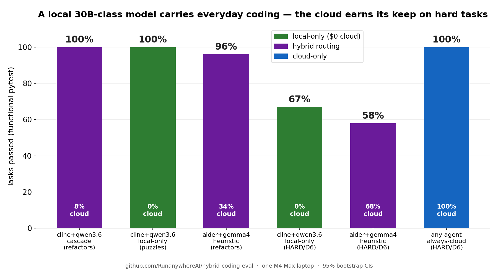
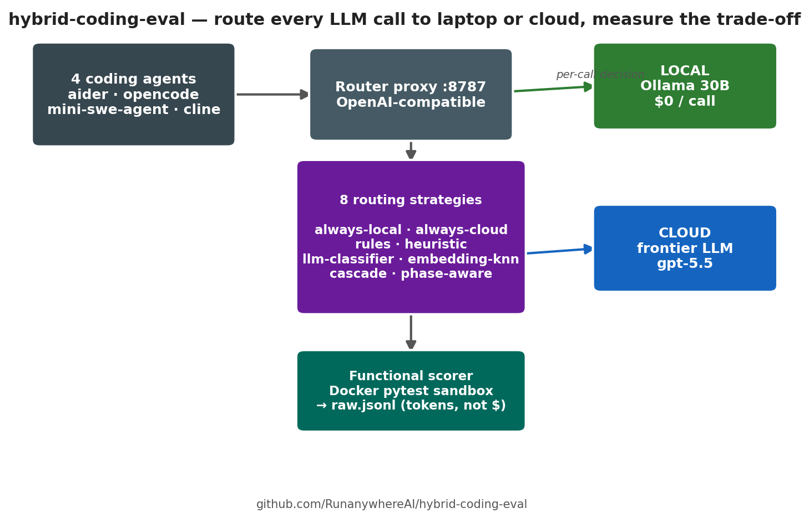
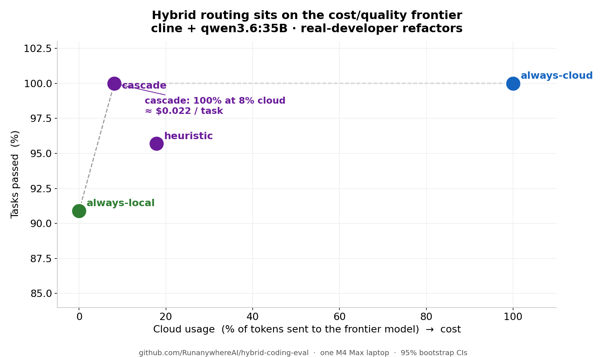

# Should this coding task run on my laptop, the cloud, or split between them?

*A reproducible benchmark of local vs. cloud vs. hybrid LLM routing for coding
agents — measured end-to-end on a single M4 Max laptop, with confidence
intervals on every number. Anyone can clone it, run it, and generate the same
kind of dataset for their own models, agents, and tasks.*



---

## The question

Local code models got good, fast. A 30-billion-parameter model that fits in
~18 GB of unified memory now writes real refactors that pass real test suites.
At the same time, the price gap between a frontier cloud model and that local
model is roughly **100×**.

So the interesting question stopped being *"can the cloud do it?"* (yes,
obviously) and became:

> **Which coding tasks can stay on my laptop — and when is it actually worth
> reaching for the cloud?**

`hybrid-coding-eval` answers that empirically. It takes four real coding agents
(**aider, opencode, mini-swe-agent, cline**), points every LLM call they make at
a small local **router**, and lets the router decide — *per call* — whether to
answer with a **local** Ollama model or a **cloud** frontier model. Same agent,
same task, eight different routing strategies. Because the agent and the task are
held constant, quality, cost, and latency become directly comparable.

Everything ran on one laptop. No cluster. Every published number traces back to a
single row in a results file, and cost is computed from token counts × a pinned
price table — so you can re-price the entire dataset under a different model's
rates without re-running a single inference.

This article walks through **everything**: the exact problems that were solved
and how hard they were, the benchmarks behind them, the four agents, the eight
routing strategies, every model used, what we found, why it's trustworthy, what
hybrid routing buys you, and how anyone can reproduce it — or extend it into a
much bigger dataset.

---

## Headline findings

All numbers below are from the **official** `bootstrap_cis.json` shipped in the
release tarballs (v1.4.0 / v1.4.1) and the recomputed v1.5.0 hard-task set.
Pass-rates are functional (real pytest suites). Cloud-fraction is token-based
(Σ cloud tokens ÷ Σ all tokens). Cost is derived from tokens × gpt-5.5 list
pricing.

| Configuration | Result | Cloud used | Notes |
| --- | --- | --- | --- |
| **cline + qwen3.6 + cascade**, real refactors (D1/D5) | **24/24 = 100%** | **8%** of tokens | Cleanest hybrid cell — **≈ $0.022 / task** |
| cline + qwen3.6 + always-local, Exercism puzzles | 15/15 = 100% | **0%** | Local-only nails them, $0 cloud |
| aider + gemma4 + heuristic, real refactors (D1/D5) | 23/24 = 96% [88, 100] | 34% | The v1.3 marquee — replicates |
| cline + qwen3.6 + always-local, **hard** tasks (D6) | 8/12 = 67%¹ | **0%** | 30B local-only ceiling, zero cloud |
| aider + gemma4 + heuristic, **hard** tasks (D6) | 7/12 = 58% | 68% | Heuristic routing breaks — and spends *more* |
| any agent + always-cloud, **hard** tasks (D6) | 12/12 = 100% | 100% | gpt-5.5 ceiling holds on D6 |

¹ Conservative reading. 3 of the 4 misses are `cline` session-management bugs
(the model never wrote code), not quality failures. The analyzer, which excludes
error rows, scores this cell **8/9 = 89%**. We quote the stricter **67%** so the
headline never flatters the local model.

Read those rows together and the story is sharper than "local good" or "cloud
good":

1. **For everyday refactors, a 30B local model carries almost the whole load.**
   The best hybrid cell solves *every* real-world refactor task while sending only
   ~8% of its tokens to the cloud — roughly **two cents a task** (verified:
   $0.0221 from the measured tokens × gpt-5.5 rates).

2. **On genuinely hard implementation tasks, the cloud advantage is real.** A
   local-only model tops out around 67–89%; cloud-only holds 100%. The point
   estimates are far apart — though with only n=12 per cell, treat the gap as a
   strong signal, not a precise margin.

3. **The biggest lever is the local model, not the routing cleverness.** Swapping
   the local model (qwen3-coder → gemma4 → qwen3.6) moved results far more than
   swapping routing strategies did. A good local model with a dumb router beats a
   mediocre local model with a clever one.

4. **Multi-step "hybrid orchestration" did not pay off.** An earlier era of this
   project built elaborate cloud-plans / local-executes pipelines (including the
   Stanford "Minion" protocol). On a 250-row replication they cost **1.9×–5×**
   *more* than just calling the cloud, for no quality gain. The thing that works
   is boring: **route each call to the right place.** The choreography loses.

5. **Routers can't reliably tell hard from easy.** The strategy that scored 100%
   on normal refactors dropped on hard ones — and the heuristic router on the hard
   set actually spent *more* on cloud (68%) while scoring *less* (58%). When a task
   is known to be hard, forcing it to the cloud beats trusting the router to
   notice.

These are findings *with their failure cases attached* — the part most benchmarks
leave out.

---

## What kind of problems were actually solved? (and how hard were they)

This is the question that matters most, so here it is concretely. The benchmark
spans **three live task classes** today, plus a richer **MVP/v3 era** that
included real GitHub PRs. Every task is **functionally scored** — the model's
output is run against a real test suite in a Docker sandbox; "looks right" never
counts.

### Tier 1 — Puzzles (Exercism Python) — *junior, single-function*

Five classic exercises from the Aider polyglot benchmark (derived from Exercism):
**`grep`, `list-ops`, `phone-number`, `pig-latin`, `robot-name`**. Single file,
single concept, hidden tests. A competent junior finishes each in a few minutes.
They're the "can the local model write correct small Python at all?" floor — and
a 30B local model (cline + qwen3.6) passes **15/15 with zero cloud**.

### Tier 2 — Real-developer refactors, D1 (feature-add) — *mid-level*

Four tasks that look like a normal Tuesday ticket. The model is dropped into a
small fixture repo and must make the suite pass:

- **`d1-rate-limit`** — implement a **sliding-window rate-limit middleware** for a
  tiny stdlib HTTP app (expose a `RateLimit` middleware with the documented
  behaviour).
- **`d1-retry-decorator`** — implement an **exponential-backoff `retry` decorator**
  and wire it onto `client.fetch_json`.
- **`d1-json-schema`** — add **JSON-schema-style body validation** to `POST /users`
  via a `validate_user(body)` function.
- **`d1-auth-login`** — implement `login()` so the suite passes (return a
  32-char lowercase hex token on success, etc.).

### Tier 2 — Real-developer scripts, D5 (one-shot) — *mid-level, no scaffolding*

Four "write me a script that does X" tasks, scored on their actual I/O behaviour:

- **`d5-todo-counter`** — recursively walk the CWD and count whole-word `TODO` /
  `FIXME` / `XXX` tokens.
- **`d5-csv-dedupe`** — read a CSV from stdin, write a de-duplicated CSV to stdout,
  keeping the header.
- **`d5-log-errors-today`** — a **bash** script that extracts `ERROR`-level lines
  from a log file given as `$1`.
- **`d5-env-var-redactor`** — read a JSON object from stdin and redact
  credential-looking values.

On the D1/D5 set, **cline + qwen3.6 + cascade goes 24/24 = 100% at 8% cloud**, and
**aider + gemma4 + heuristic goes 96%** — both statistically on par with
cloud-only.

### Tier 3 — Hard implementation challenges, D6 — *senior, algorithmic*

Added in v1.5 specifically because the easier tiers were saturating at 100% and
the leaderboard had no ceiling left to measure. Four single-file builds, **80
pytest assertions total**, each stressing a different hard skill:

| Task | Tests | What it actually demands |
| --- | --- | --- |
| **`d6-lru-ttl-cache`** | 23 | An LRU cache with **per-entry TTL eviction** — `OrderedDict` recency, a monkey-patchable clock, correct eviction accounting, capacity/TTL validation. |
| **`d6-token-bucket`** | 14 | A **multi-key token-bucket rate limiter** — lazy refill math, per-key isolation, non-positive-input validation. |
| **`d6-toposort`** | 16 | **Deterministic topological sort + cycle detection** — Kahn's algorithm with a stable tie-break, plus a `CycleError` that reconstructs the actual cycle path. |
| **`d6-mini-template`** | 27 | A **templating engine** — a recursive-descent parser + AST evaluator with nested `if`/`for`, escape filters, comments, and a `TemplateError` on malformed input. |

This is not boilerplate. `d6-mini-template` is a real little language
implementation; `d6-toposort` requires reconstructing the cycle, not just
detecting one. On D6, **local-only tops out at ~67–89%**, **cloud-only holds
100%**, and the **heuristic router both scores worse and spends more** — the
single clearest "the cloud earned it" result in the project.

### The MVP / v3 era — real GitHub PRs (SWE-bench Verified) and more

Before the current agentic leaderboard, the project's first ~430 rows ran a wider
benchmark set. This is where **real merged pull requests** were measured:

- **SWE-bench Verified** — the human-validated subset of SWE-bench. Real PRs from
  **django, sphinx, astropy, xarray** (e.g. `django__django-15315`,
  `sphinx-doc__sphinx-9711`, `astropy__astropy-7166`), driven through
  mini-swe-agent and scored by the **upstream SWE-bench harness** (the model must
  produce a diff that passes the PR's own test suite).
- **HumanEval+** — function-synthesis problems with hardened tests.
- **BigCodeBench-Hard** — library-heavy programming tasks (numpy/pandas/flask/…),
  run against their suites in the same Docker sandbox.
- **custom-arch** — five reasoning/architecture prompts (auth multitenancy,
  cache-invalidation trade-offs, zero-downtime migration planning, …) that were
  LLM-judged.

That era's honest, *negative* headline: **multi-step hybrid orchestration lost** —
on real PRs the fancy pipelines were Pareto-dominated by plain cloud-only. Those
runs are preserved, immutable, in `results/runs/` for reproducibility.

### The honest status of SWE-bench in the *current* benchmark

The current v1.x leaderboard's headline numbers are on **puzzles + refactors**,
**not** SWE-bench. The SWE-bench Verified **adapter is shipped and reproducible**
(`configs/v1.4-real-prs.yaml` loads 10 real PRs from django/sphinx/flask/click/…
and scores via the upstream harness), but the **agentic SWE-bench sweep is
deferred to v1.6**. If anyone cites a v1.x pass-rate, it's on functionally-scored
puzzles and refactors. We keep that line bright on purpose.

### Problem → benchmark → scoring, at a glance

| Class | Source benchmark | Scoring | Complexity |
| --- | --- | --- | --- |
| puzzles | Exercism (Aider polyglot) | pytest in Docker | junior |
| refactors D1 | hand-built real-dev fixtures | pytest in Docker | mid |
| refactors D5 | hand-built real-dev fixtures | behavioural (stdin/stdout, files) | mid |
| refactors D6 | hand-built hard fixtures | pytest (80 assertions) | senior/algorithmic |
| real-prs | SWE-bench Verified | upstream SWE-bench harness | real-world (v1.6 sweep) |
| *(MVP)* | HumanEval+, BigCodeBench-Hard, custom-arch | pytest / LLM-judge | mixed |

---

## The four coding agents

Each agent is a **thin wrapper** around an externally-maintained tool. The repo
owns the routing, scoring, analysis, and result schema — it does not try to be a
coding agent. All four talk to the same router via an OpenAI-compatible API, so
the routing layer is identical across them. (All **four** are wrapped; the v1.4/
v1.5 canonical leaderboard sweeps **three** of them — aider, cline, opencode —
while mini-swe-agent is the SWE-bench-era agent. That's why the headline stats
say "3 agents.")

- **aider** — architect/editor protocol. It plans a change ("architect"), then
  emits a tight diff ("editor"). Low call count (~2 median), very parsable
  patches, and the architect/editor split is naturally routing-friendly. Strong on
  gemma4; noticeably model-sensitive (96% on gemma4 refactors → 33% on
  qwen3-coder).

- **cline** — a Plan/Act ReAct agent (the VS Code agent, run headless). It takes
  8–14 turns, iterating against the workspace. That iteration is exactly why it
  wins at 30B local: it recovers from its own mistakes. It's the backbone of the
  champion cell.

- **opencode** — a free-form tool-use ReAct agent (Read/Write/Edit/Bash/Grep/Glob).
  High ceiling when its tool-calls are clean — but it needs the local model to emit
  well-formed `tool_calls`. gemma4 does; the qwen variants don't reliably, so
  opencode is effectively **gemma4-specific** on this benchmark.

- **mini-swe-agent** — a minimalist (~100 LOC) bash-only ReAct loop, closest to
  the SWE-bench reference harness. Used mainly in the MVP/v3 SWE-bench era.

A practical takeaway: **the agent and the local model have to be matched.** cline
pairs with the qwen3.6 dense model; aider and opencode prefer gemma4. A
mismatched pair can swing a cell by 40+ points.

---

## The eight routing strategies, in plain terms



Every strategy is one small function. Given the request the agent is about to
send, it returns `local` or `cloud`, plus a reason and a confidence. You can also
force a backend on a single call by appending `!local` or `!cloud` to the model
name.

1. **always-local** — Never use the cloud. The control that measures "how far does
   my laptop get on its own, for $0?"
2. **always-cloud** — Always use the cloud. The quality ceiling and the cost
   ceiling. Every other strategy is judged against these two.
3. **rules** — A hand-written checklist. Huge prompt (>4,000 tokens), ≥3 code
   blocks, or "thinking" words (*design, architecture, refactor entire, security,
   migration plan*) → cloud. "Trivial" words (*rename, typo, format, one-liner*) →
   local. Otherwise default local. Fast, transparent, no model in the loop.
4. **heuristic** — The workhorse, and the cleverest cheap one. It's *agent-aware*:
   it knows a coding agent is in a loop and scores only the **newest message** (the
   latest tool result or instruction), not the whole transcript. A short "command
   succeeded" echo scores low → local; a fresh planning step scores high → cloud.
   It also reads the **phase**: the first call of a task gets nudged to cloud; a
   call that's just digesting a tool result gets nudged to local. Cross the score
   threshold → cloud.
5. **llm-classifier** — Ask a *tiny* local model (`qwen3:0.6b`, ~50–200 ms) one
   question: "is this SIMPLE or COMPLEX?" A cheap learned judge instead of
   hand-written rules.
6. **embedding-knn** — Embed the prompt (`nomic-embed-text`), find its 5 nearest
   neighbours in a 50-example labelled corpus (25 "local-ish", 25 "cloud-ish"), and
   vote. "Does this look more like things I'd keep local or send to the cloud?"
7. **cascade** — The champion. Run the fast heuristic first. If it's *confident*
   (score clearly high or low), trust it — no extra cost. Only in the **uncertain
   middle** does it pay for the tiny classifier to break the tie. Cheap on the easy
   majority, careful on the genuine maybes.
8. **phase-aware** — A specialist for aider, which already splits its work into an
   "architect" step and an "editor" step. This honours that split deterministically:
   architect → cloud, editor → local. Plan expensively, type cheaply.

The punchline of the whole project: the clever strategies barely beat the simple
heuristic, and *which local model you pick* matters more than which strategy you
choose. `cascade` wins not by being smart but by being **cheap-when-sure**.

---

## Every model used

**Local models (Ollama, the laptop half):**
- `gemma4:31b` — dense generalist; best with aider/opencode.
- `qwen3.6:35b-A3B` — dense generalist; the champion with cline.
- `qwen3-coder:30b` — MoE coding specialist.
- `devstral:24b` — SWE-bench-specialised; used in the MVP/v3 era.
- *(MVP/v3 also swept qwen2.5-coder, GLM-flash, and qwen3.6-27b variants.)*

**Router micro-models (the decision half):**
- `qwen3:0.6b` — the SIMPLE/COMPLEX classifier for `llm-classifier` and `cascade`.
- `nomic-embed-text` — the embedder for `embedding-knn`.

**Cloud model (the frontier half):** `gpt-5.5` is the primary. Because cost is
derived from tokens, the same dataset is **re-priced under six scenarios** at
analysis time — `gpt-5.5`, `gpt-5`, `gpt-5-mini`, `claude-opus-4-7`,
`claude-sonnet-4-6`, `claude-haiku-4-5` — without re-running anything.

---

## Why these numbers are trustworthy

Most "local vs cloud" takes are vibes. This one is built to be checked:

- **Token-first, cost-derived.** Rows store *tokens*, never dollars. Cost is
  computed from a SHA256-pinned price table shared by the Python harness and the
  Node router (a parity test asserts they agree). Want the answer under Claude
  pricing instead of GPT pricing? Re-run the analysis; don't re-run the benchmark.
- **Bootstrap confidence intervals on every cell.** "X beats Y" is only claimed
  when the 95% intervals support it. The marquee cell is **96% [88, 100]**, not a
  bare number.
- **Full provenance per row.** Every row carries task, route, strategy, seed,
  local + cloud model IDs, the config hash, and a hardware-profile reference.
- **Crash-resumable, honest about failures.** Rows flush as they complete; a crash
  loses at most one row. Where a result is an agent *session* bug rather than a
  model-quality failure, the notes say so (see footnote ¹) instead of quietly
  scoring it as a loss.
- **The negative results are kept.** The refuted Minion hypothesis, the dead-end
  cascade-threshold tuning, the runaway-generation crash that forced the local
  guardrails — all documented, not buried.

---

## What hybrid routing actually buys you (impact)



The Pareto chart above is the whole pitch in one image. For real refactors on
cline + qwen3.6:

- **always-local** — 91% pass, **$0**.
- **cascade** — **100% pass at 8% cloud, ≈ $0.022/task** — same quality as
  cloud-only at a fraction of the spend.
- **heuristic** — 96% at 18% cloud.
- **always-cloud** — 100%, but **100% of the spend** (~100× the per-call price).

So the concrete benefits:

1. **~90% cost reduction at equal quality** on the bulk of real work, by keeping
   the easy majority of calls on the laptop and spending cloud money only where it
   changes the answer.
2. **Privacy + offline capability for free** — the local-only column is a real,
   $0, no-data-leaves-the-machine option that still clears 90%+ on everyday
   refactors and 67% on genuinely hard ones.
3. **A decision rule you can actually act on**: use `cline + a strong 30B + cascade`
   for day-to-day work, keep a hard `!cloud` override for tasks you already know are
   nasty, and don't bother with multi-step orchestration.
4. **Vendor-neutral economics** — because pricing is swapped in at analysis time,
   the same data answers "what would this cost on Claude / on gpt-5-mini?" instantly.

---

## How this scales — and the real goal: reproducible datasets for everyone

The deeper purpose of this repo is not the six numbers in the headline table. It's
that **the whole thing is a reproducible data-generation machine** that anyone can
run and extend. The design makes four kinds of scaling cheap:

- **Add a local model in three commands.** `ollama pull <model>` →
  `./bench sweep --set models.local=<model> …` → `./bench analyze`. Drop any new
  Ollama model onto the same canonical pre-D6 4-strategy, 13-task, 3-seed matrix
  (5 puzzles + 4 D1 + 4 D5; the full grid is 8 strategies × 17 tasks) and get a
  directly comparable cell.
- **Add an agent, strategy, or task class** by following `CONTRIBUTING.md` — one
  module each. The cell key (`refactors::cline::cascade`) flows end-to-end, so new
  dimensions slot into the same aggregation and charts.
- **Pool results across machines.** Every row is self-describing (hardware
  profile, config hash, model IDs, seed). Two people on two laptops produce rows
  that merge into one dataset without ambiguity about how they were made.
- **Re-price without re-running.** New model pricing? Edit one JSON file and
  re-analyze. The expensive part (inference) is never repeated.

That's the vision: **one laptop, no cluster, and a standard harness** so the
community can collectively benchmark *which coding tasks belong on local models* —
across many agents, many routing strategies, and many models — and grow a shared,
comparable, confidence-interval'd dataset over time. Every release here was
produced exactly this way: 1,704 rows across 3 local models, 3 agents, 8
strategies, 17 tasks, on a single M4 Max.

---

## How to reproduce it yourself

Five minutes to a green smoke run; about an hour to a full canonical sweep on an
M4 Max. The complete step-by-step (pause/resume for overnight runs, benchmarking a
new model, re-pricing) lives in [`REPRODUCING.md`](./REPRODUCING.md). The short
version — **anyone can do this from a clean clone or a downloaded release**:

```bash
# 1. Clone + install
git clone https://github.com/RunanywhereAI/hybrid-coding-eval
cd hybrid-coding-eval
python3.12 -m venv .venv
.venv/bin/pip install -e ".[dev,agents]"
cp .env.example .env          # paste your OpenAI key

# 2. One-time setup (Docker scoring image + agent CLIs + health check)
./bench setup

# 3. 30-second smoke test (cloud only — no local model needed yet)
./bench sweep --config configs/v1.4-smoke.yaml --strategies always-cloud --seeds 42
./bench analyze results/runs/v1.4-smoke

# 4. A real hybrid sweep (pull a local model first, ~18 GB)
ollama pull gemma4:31b
./bench sweep --config configs/v1.4-canonical-gemma4.yaml \
    --strategies always-cloud,always-local,heuristic,cascade --seeds 42,7,13
./bench analyze results/runs/v1.4-canonical-gemma4
```

Then check the headline cell, and compare against the published dataset:

```bash
jq '.cells["refactors::cline::cascade"].pass_rate' \
   results/runs/<your-sweep>/bootstrap_cis.json

gh release download v1.5.1 -p results-v1.5.1.tar.gz   # == v1.5.0 dataset bytes
```

**What it costs you:** the smoke run is ~$0.01. A full canonical sweep is ~10–15 h
of wall time and roughly $30–50 of cloud spend at frontier pricing, plus an 18 GB
model download. The smoke run gives you a green checkpoint before you commit to
any of that.

---

## The takeaways

- **A good 30B local model handles the bulk of everyday coding work.** For real
  refactors, the best hybrid setup hit 100% while sending ~8% of tokens to the
  cloud — about two cents a task.
- **The cloud earns its keep on genuinely hard problems**, where local tops out
  near two-thirds to 89% and frontier models hold 100%.
- **Pick the local model carefully; the router second.** Model choice was the
  dominant lever in every sweep, and the agent must be matched to the model.
- **Skip the elaborate hybrid choreography.** Per-call routing wins; multi-step
  orchestration lost on cost, quality, *and* latency.
- **When you know a task is hard, just send it to the cloud** — routers have a real
  blind spot for difficulty.
- **It's a machine, not just a result.** The real deliverable is a reproducible
  harness anyone can run on one laptop to generate comparable datasets across
  agents, strategies, and models.

If you run local models for coding, the practical recommendation is concrete:
**cline + a strong 30B (qwen3.6-class) local model + the cascade router** for
day-to-day refactor work, and a hard `!cloud` override in your pocket for the
problems you already know are nasty.

---

*Reproduce any number here from a clean clone. Found a discrepancy, or want a new
model on the leaderboard? Open an issue — that's exactly what this repo is for.*

*Benchmark, data, charts, and this article are all MIT-licensed. A citation in
derived work is appreciated; the BibTeX block is in the
[README](../README.md#license--citation).*
